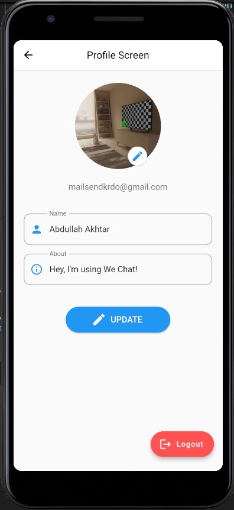
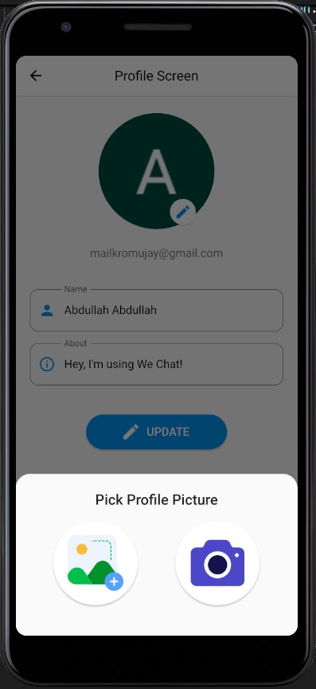
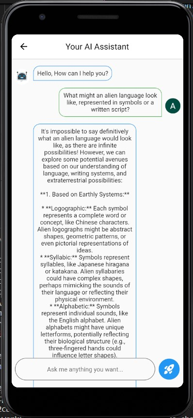
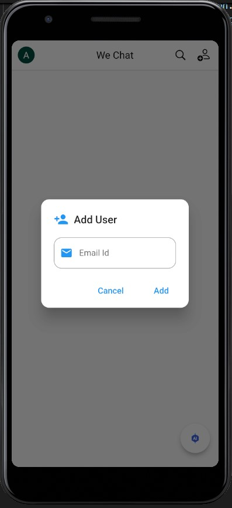
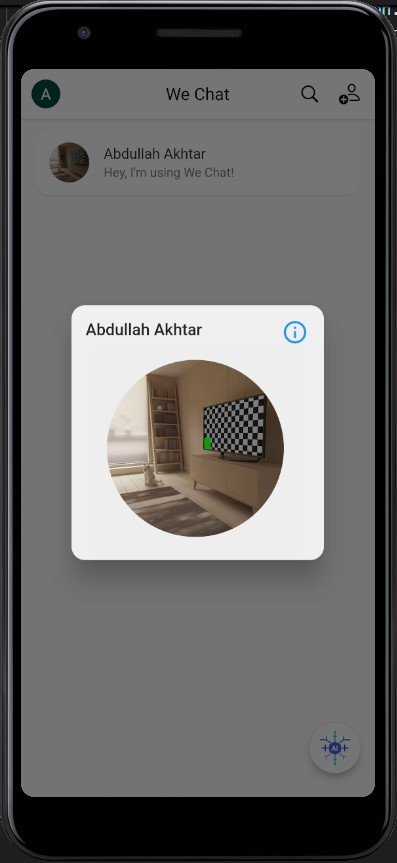
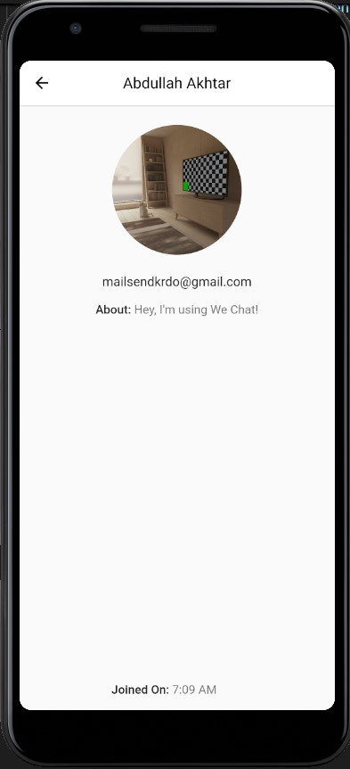
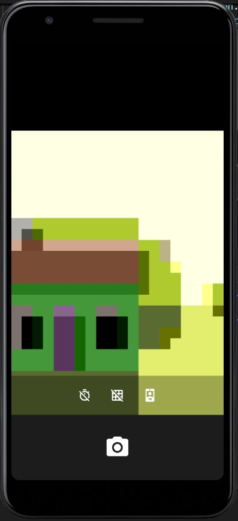
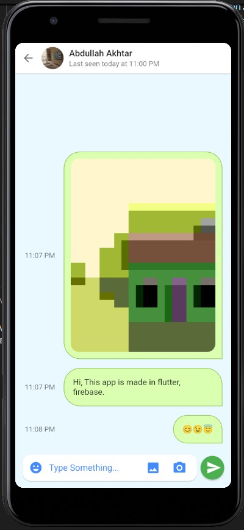

# Realtime Chat App

A new Flutter project.

## Getting Started

This project is a starting point for a Flutter application.

A few resources to get you started if this is your first Flutter project:

- [Lab: Write your first Flutter app](https://docs.flutter.dev/get-started/codelab)
- [Cookbook: Useful Flutter samples](https://docs.flutter.dev/cookbook)

For help getting started with Flutter development, view the
[online documentation](https://docs.flutter.dev/), which offers tutorials,
samples, guidance on mobile development, and a full API reference.

## Screenshots

Here are some screenshots of the application:

## Profile Screen

## Profile Picture Upload/Replace

## Chat with Ai Assistant

## Add Friends/Users through email

## See users info - you can opt to show any info

## See user/friend's profile

## Add New Profile Picture Upload or Capture

## Chat with friends, upload images, captured images, emojis, text sms

